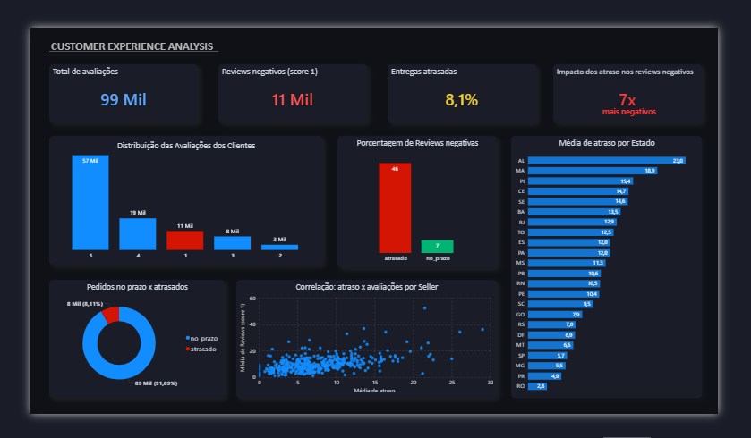

# Análise de Experiência do Cliente - Olist

## 🧠 Contexto
Em marketplaces com alto volume de pedidos, compreender a experiência do cliente é fundamental para a tomada de decisão.

Neste projeto, foi realizada uma análise de dados da plataforma Olist com o objetivo de identificar os principais fatores que impactam a satisfação dos clientes, com foco especial em avaliações negativas.

## 🎯 Objetivo
Investigar os principais fatores que levam clientes a avaliações negativas e identificar oportunidades de melhoria na experiência do cliente.

## ❓ Perguntas de Negócio
- Quais fatores influenciam avaliações negativas?
- O atraso na entrega impacta a satisfação do cliente?
- A insatisfação está concentrada em vendedores específicos?
- Existem padrões regionais nos atrasos?

## 🔍 Principais Insights
- 📉 __Pedidos atrasados têm ~7x mais chance de receber avaliações negativas__
- 🚚 Apenas __6,6%__ dos pedidos no prazo recebem avaliações negativas
- ⚠️ Esse número sobe para aproximadamente __46%__ em pedidos atrasados
- 🧑‍💼 A insatisfação não está concentrada em poucos vendedores
- 🌎 Existem variações regionais relevantes nas taxas de atraso

## 📦 Sobre os Dados
- Fonte: Dataset público da Olist (Kaggle)
- Dados tratados para correção de inconsistências em campos de preço e formatação
- Integração de múltiplas tabelas (pedidos, entregas, avaliações, sellers, etc.)

## 🛠️ Ferramentas Utilizadas
- SQL (extração, tratamento e análise)
- Power BI (modelagem e visualização)
- DAX (criação de métricas e indicadores)

## 📊 Dashboard

## 🧪 Etapas da Análise
### 1. Exploração inicial
- Identificação de padrões nas avaliações
- Destaque para alta frequência de avaliações negativas (nota 1)
### 2. Análise qualitativa
- Leitura de comentários de clientes
- Identificação de problemas recorrentes:
  - atrasos
  - problemas com produto
  - pedidos incompletos
### 3. Análise de vendedores
- Avaliação da distribuição de reviews negativos
- Comparação de taxas por seller
- Conclusão: problema não concentrado
### 4. Entrega vs Satisfação
- Comparação entre pedidos no prazo vs atrasados
- Identificação do impacto direto da logística na experiência
### 5. Análise regional
- Identificação de estados com maiores taxas de atraso
- Indicação de gargalos logísticos localizados

## 📌 Conclusão
A análise demonstrou que a insatisfação do cliente não está concentrada apenas em vendedores ou categorias específicas, mas também fortemente associada a falhas no processo logístico.

Atrasos na entrega se destacam como o principal fator de impacto negativo na experiência do cliente, aumentando significativamente a probabilidade de avaliações negativas.

Além disso, a presença de variações regionais indica a existência de gargalos específicos que podem ser tratados de forma direcionada.

## 💡 Recomendações
- Otimizar processos logísticos e reduzir atrasos
- Revisar prazos de entrega para maior precisão
- Investigar regiões com maior incidência de atraso
- Monitorar continuamente indicadores de satisfação
- Realizar análises mais detalhadas com dados geográficos

## 🚀 Sobre o Projeto
Este projeto demonstra a aplicação de análise de dados para geração de insights de negócio, transformando dados brutos em informações acionáveis para melhoria da experiência do cliente.

## 📁 Arquivos do Projeto
